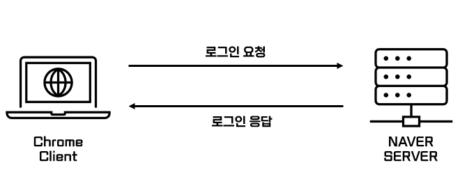

## CORS(Cross Origin Resource Sharing)

* CORS란 현재 IP가 아닌 다른 IP로 리소스를 요청하는 구조

### Origin

* 요청이 시작된 서버의 위치를 나타내는 문구

* 예) Naver 로그인 서버로 로그인 요청을 할 경우

  1. Client 서버(http://client:80)

  2. Naver 로그인 API 서버(http://login:3000)

  * 2개의 IP는 서로 다른 IP 번호를 갖고 있음

* console.log(location.origin)

* 클라이언트 서버가 로그인 서버에게 HTTP 요청을 보낼 때 **Origin이 다르다(Cross Origin)**
* 만약 로그인 서버가 내부 통신을 통해 서버 내 데이터를 가져온다면 Same Origin이라 함(그럴 일이 드물긴함,,)

### Origin 구분 방법

1. 스키마
2. HOST
3. Port

* https://yeonz.tistory:80/post
* https://yeonz.tistory:80/post/id?page=10
* https://yeonz.tistory:80/main/post/commet
* 위 세개의 주소는 모두 동일한 Origin

### SOP(Same Origin Policy)

* RFC 6454에서 등장한 보안 정책으로 **동일한 출처의 Origin만 리소스를 공유**할 수 있음을 의미
* SOP 때문에 CORS 문제를 겪는 것

### Access-Control-Allow-Origin

* SOP 정책에 따르면 같은 Origin만 자원 공유가 가능 -> 그렇다면 다른 Origin에서 자원 이용을 못할까?
* Access-Control-Allow-Origin을 통해 서로 다른 Origin에서 자원 공유 가능(CORS 해결)

### 결론

1. HTTP 통신 헤더인 Origin 헤더에 요청을 보내는 곳의 정보를 담고 서버로 요청 전송
2. 서버는 Access-Control-Allow-Origin 헤더에 허용된 Origin이라는 정보를 담아 보냄
3. 클라이언트는 헤더의 값과 비교해 정상 응답임을 확인하고 지정된 요청을 전송
4. 서버는 요청을 수행하고 200 OK 코드를 응답

※ Postman에서는 CORS 오류가 안나는 이유 

* Postman은 브라우저가 아닌 개발 도구
* SOP 정책은 브라우저 -> 서버와 관련된 정책

