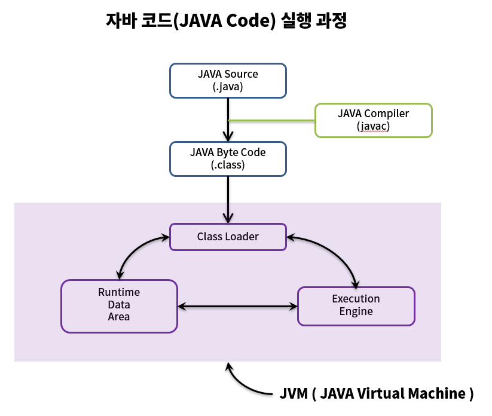
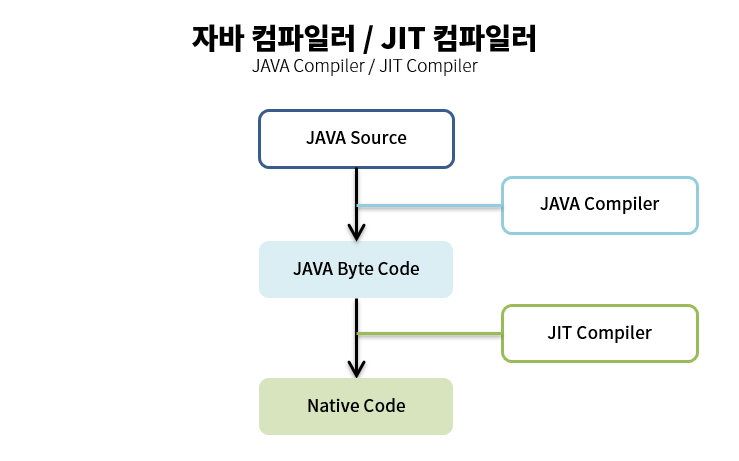

### JAVA 컴파일 과정

자바는 OS에 독립적인 특징을 갖고 있음 

* C/C++은 같은 기능의 소스를 각 하드웨어에 맞게 작성해야 하는 번거로움이 있음

* JAVA는 하드웨어(CPU), 운영체제(OS) 상관없이 컴파일된 코드(바이트 코드)가 플랫폼 독립적
  * 플랫폼 : 개발환경, 실행환경 등 어떤 목적을 수행할 수 있는 환경

* 어느 플랫폼이든 작성한 소스를 변경할 필요 없이 실행 가능

#### JVM(JAVA Virtual Machine)

> 컴파일된 코드(바이트 코드)를 실행시켜주는 가상의 컴퓨터
>
> JVM은 하드웨어와 운영체제 위에서 실행되기 때문에 JVM 자체는 플랫폼에 종속적. 즉 플랫폼에 따라 호환되는 JVM을 실행시켜 주어야 함

#### 자바 코드 실행 과정

1. 작성한 `자바 소스(JAVA Source)`, 즉 확장자가 .java인 파일을 `자바 컴파일러(JAVA Compiler)`를 통해 `자바 바이트 코드(JAVA Byte Code)`로 컴파일
2. 컴파일된 바이트 코드를 JVM의 `클래스 로더(Class Loader)`에게 전달 

3. 클래스 로더는 `동적 로딩(Dynamic Loading)`을 통해 필요한 클래스들을 로딩 및 링크하여 `런타임 데이터 영역(Runtime Data Area, JVM의 메모리)`에 올림

4. `실행 엔진(Execution Engine)`은 JVM 메모리에 올라온 바이트 코드들을 명령어 단위로 하나씩 가져와서 실행

   * 인터프리터 
     * 바이트 코드 명령어를 하나씩 읽어서 해석하고 실행
     * 하나하나의 해석은 빠르지만 전체적인 실행 속도는 느림
     * JVM 안에서 바이트코드는 기본적으로 인터프리터 방식으로 동작

   * JIT 컴파일러(Just-In-Time Complier)
     * 인터프리터의 단점을 보완하기 위해 도입된 방식
     * 바이트 코드 전체를 컴파일하여 네이티브 코드로 변경하고, 이후에는 해당 메서드를 더 이상 인터프리팅하지 않고 네이티브 코드로 직접 실행하는 방식
     * 하나씩 인터프리팅하여 실행하는 것이 아니라 바이트 코드 전체가 컴파일된 네이티브 코드를 실행하는 것이기 때문에 전체적인 실행 속도는 인터프리팅 방식보다 빠름

### 요약

자바의 플랫폼 독립성을 실현 가능하게 하는 것은 자바 가상 기계(JVM)와 바이트 코드(Byte Code) 덕분이다.

[[JAVA] JVM 동작원리 및 기본개념](https://steady-snail.tistory.com/67)

[JAVA(자바)란 무엇일까? (+ 등장배경, 플랫폼 종속성, 플랫폼 독립성, WORA)](https://usefultoknow.tistory.com/entry/JAVA%EC%9E%90%EB%B0%94%EB%9E%80-%EB%AC%B4%EC%97%87%EC%9D%BC%EA%B9%8C-%EB%93%B1%EC%9E%A5%EB%B0%B0%EA%B2%BD-%ED%94%8C%EB%9E%AB%ED%8F%BC-%EC%A2%85%EC%86%8D%EC%84%B1-%ED%94%8C%EB%9E%AB%ED%8F%BC-%EB%8F%85%EB%A6%BD%EC%84%B1-WORA)