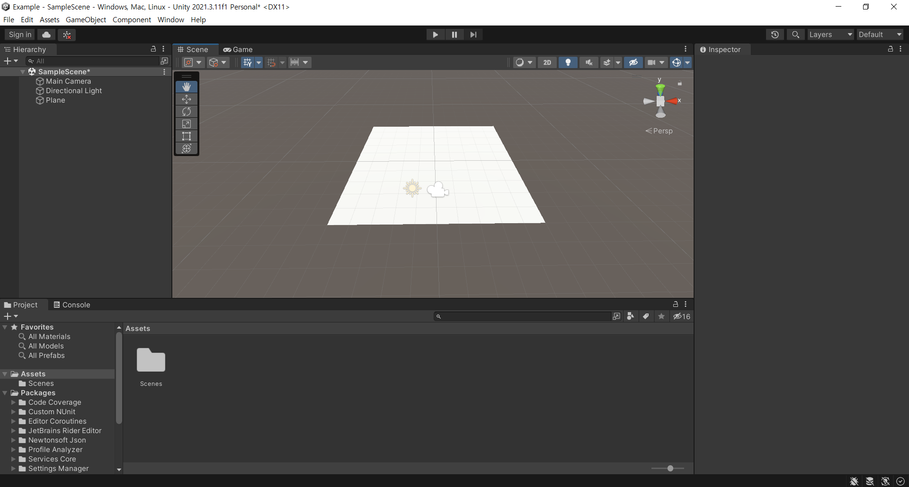
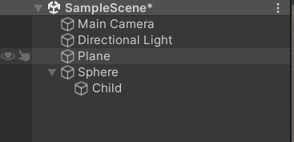
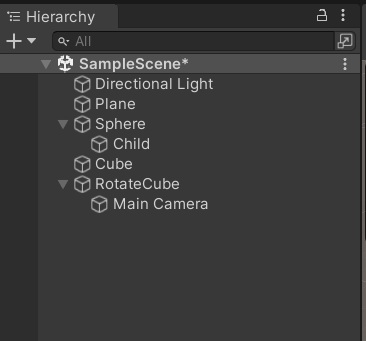

# Unity

------



[Q/W/E/R] : Object 설정 변경

[F] : 오브젝트 시점 자동 변환

[Ctrl + Shift + F] : 카메라 시점 자동 변환


## Basic

모든 오브젝트는 Inspector -> Transform 우클릭 -> reset을 하여 위치를 초기화시킨 후 이동시키는 것이 좋음


## Assets 

프로젝트 안에서 사용될 다양한 리소스들이 담기는 공간

* Images : 다양한 텍스처와 같은 이미지
* Audios : 게임 내 사운드
* Scenes : 화면 파일들
* Scripts : 모델이 움직이도록 프로그램을 작성한 코드
* Models : 모델
* Animations : 모델 애니메이션
* Prefabs : 특정한 모델을 대상으로 프로젝트에 실제로 사용할 수 있도록 다양한 커스터마이징되어 재구성해놓은 것


### Script

스크립트를 적용할 오브젝트로 끌어다놓기 -> 해당 스크립트로 오브젝트를 컨트롤러 가능!

```C#
// MonoBehaviour : 사전에 구현이 된 유니티 내부적인 처리를 연동
public class MainController : MonoBehaviour
{
    public int timer = 0;
    
    // Start is called before the first frame update
    // 프로젝트 실행 시 호출되는 객체의 초기화를 위한 함수(위치 등)
    void Start()
    {
        Debug.Log("초기화가 이루어졌습니다.");
    }

    // Update is called once per frame
    // 매 프레임마다 실행이 되는 함수
    void Update()
    {
        timer++;
        Debug.Log(timer + "번째 업데이트");
    }
}

```


Visual Stuido : 기본 유니티 에디터 설정 및 자동완성 안 될 때!

https://blog.naver.com/PostView.nhn?blogId=whatsuppapa&logNo=222326681454&categoryNo=24&parentCategoryNo=0&viewDate=&currentPage=1&postListTopCurrentPage=1&from=postView


## 3D 오브젝트 이동

```C#
using System.Collections;
using System.Collections.Generic;
using UnityEngine;

public class MainController : MonoBehaviour
{

    public GameObject capsule;
    public float speed = 3.0f;

    
    void Start()
    {
        // capsule 변수를 실제 프로젝트에 존재하는 객체와 연결
        capsule = GameObject.Find("Capsule"); // 이름이 Capsule인 객체를 찾아 연결
    
    }

    
    void Update()
    {
        // Transform 컴포넌트에 접근하여 capsule 객체 위치를 이동
        // speed 3만큼 객체 이동
        // capsule.GetComponent<Transform>().Translate(Vector3.forward * speed * Time.deltaTime); // Time.deltaTime : 시간의 싱크로율을 맞추기 위함
        this.GetComponent<Transform>().Translate(Vector3.forward * speed * Time.deltaTime);
    }
}
```


### 원하는 객체 오브젝트 찾기

* GameObject.Find("이름") : 이름을 통해 찾기

* GameObject.FindWithTag("태그명") : 태그를 통해 찾기

* GameObject.FindGameObjectWithTag("태그명") : 태그를 통해 찾기

  

## 키보드로 객체 이동 시키기

```c#
// 방향키를 눌렀을 때 나무가 이동
public class TreeController : MonoBehaviour
{

    public float spped = 0.5f;

    void Start()
    {
        
    }

    // Update is called once per frame
    void Update()
    {
        if(Input.GetKey(KeyCode.UpArrow)|| Input.GetKey(KeyCode.W)) // 위 방향키 또는 W를 누르면
        {
            this.transform.Translate(0, 0, spped * Time.deltaTime);
        }
        if (Input.GetKey(KeyCode.RightArrow)) // 오른쪽 방향키를 누르면
        {
            this.transform.Translate(spped * Time.deltaTime, 0, 0);
        }
        if (Input.GetKey(KeyCode.DownArrow)) // 아래 방향키를 누르면
        {
            this.transform.Translate(0, 0, -spped * Time.deltaTime);
        }
        if (Input.GetKey(KeyCode.LeftArrow)) // 왼쪽 방향키를 누르면
        {
            this.transform.Translate(-spped * Time.deltaTime, 0, 0);
        }
    }
}
```


## 유니티 찬 캐릭터 제어하기

```c#
// 유니티 찬 캐릭터 제어하기
public class ChanMainController : MonoBehaviour
{
    public Animator animator;

    // Start is called before the first frame update
    void Start()
    {
        // 실행 시 Animator 컴포넌트를 가져오도록 초기 설정
        animator = GetComponent<Animator>();
    }

    // Update is called once per frame
    void Update()
    {
        // GetKeyDown : 스페이스를 누르고 있는 동안에는 한 번의 애니메이션만 동작
        // GetKey는 스페이스를 누르고 있으면 계속해서 여러 번의 애니메이션이 동작
        if(Input.GetKeyDown(KeyCode.Space))
        {
            animator.Play("JUMP00", -1, 0);
        }
    }
}
```


BlendTree : 여러 개의 변수를 효율적으로 관리할 수 있도록 도와줌

변수에 따라서 다양한 애니메이션을 보여줄 수 있는, 마치 가지치기를 하듯이 특정한 상황에 특정 애니메이션을 보여줄 수 있도록 함


## Rigidbody

충돌감지 등 지형물에 부딪히는 것과 같은 물리적인 효과를 구현하는데 좋음

1. Add Compoenet -> Rigidbody 추가
2. [Rigidbody] Use Gravity 체크 해제

3. [Animator] Apply Root Motion 체크 해제


## Hierarchy

**모든 객체들은 계층적인 관계를 가질 수 있음**

Sphere가 갖는 GameComponent들을 Child 또한 사용하게 됨

* 예) Sphere의 위치를 이동시키면 Child의 위치 또한 Sphere에 맞춰 이동하게 됨 



```c#
using System.Collections;
using System.Collections.Generic;
using UnityEngine;

public class SphereController : MonoBehaviour
{
    private float speed = 10.0f;
    private bool got = false; // 박스를 들고있는지 여부

    // Start is called before the first frame update
    void Start()
    {
        
    }

    // Update is called once per frame
    void Update()
    {
        if(Input.GetKey(KeyCode.W) || Input.GetKey(KeyCode.UpArrow))
        {
            transform.Translate(Vector3.forward * speed * Time.deltaTime);
        }
        if (Input.GetKey(KeyCode.S) || Input.GetKey(KeyCode.DownArrow))
        {
            transform.Translate(Vector3.back * speed * Time.deltaTime);
        }
        if (Input.GetKey(KeyCode.A) || Input.GetKey(KeyCode.LeftArrow))
        {
            transform.Translate(Vector3.left * speed * Time.deltaTime);
        }
        if (Input.GetKey(KeyCode.D) || Input.GetKey(KeyCode.RightArrow))
        {
            transform.Translate(Vector3.right * speed * Time.deltaTime);
        }

        if(Input.GetKey(KeyCode.Space))
        {
            GameObject child = GameObject.Find("Cube") as GameObject;
            if(!got) // 캐릭터가 큐브를 들고있지 않다면
            {
                child.transform.parent = this.transform; // 캐릭터가 큐브를 듦
                got = true; // 큐브를 들고있는 상태
            }
            else
            {
                child.transform.parent = null; // 큐브를 놓음
                got = false; // 큐브를 놓은 상태
            }
        }
    }
}

```


## 3인칭 카메라 만드는 방법


