## 🦄 3D 캐릭터 이동 - 걷기, 달리기, 카메라 설정


### 1. 바닥이 될 [3D Object] - [Cube] 생성

* 오브젝트의 색상이 흰색이 아니라 칙칙할 경우
  * [Window] - [Rendering] - [Lighting Settings] - [Generate Lighting]을 통해 빛 생성
* Cube의 크기 지정 : (100, 1, 100)


### 2. 벽이 될 [3D Object] - [Cube] 4개 생성

* 4개의 큐브 오브젝트로 벽 생성
* [Inspector] - [Mesh Renderer] 체크 해제를 통해 Collider는 유지하지만 겉보기만 감추기 가능

### 3. Material 설정

* [우클릭] - [create] - [Material]
* Albedo 좌측 버튼 : 기본 제공되는 텍스처 선택 가능
* Albedo 우측 : 색상 지정 가능
* Tiling : 숫자를 늘려서 텍스쳐를 타일 형태로 배치

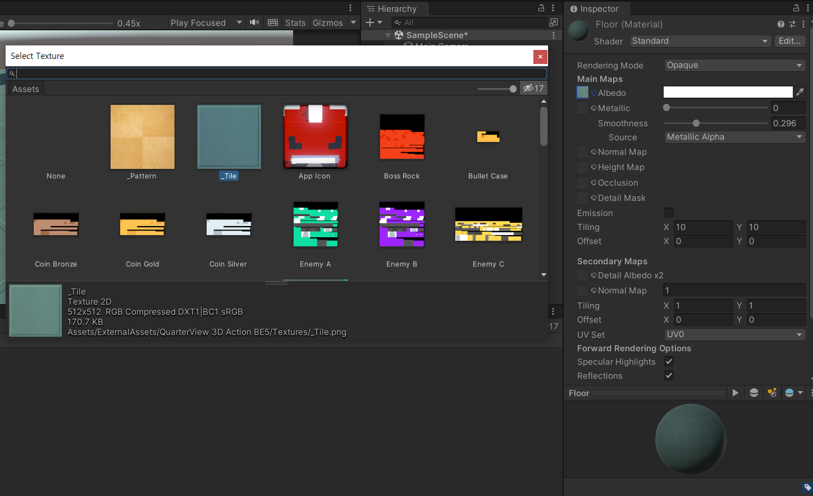

### 4. 생성한 Material을 Object에 적용

* 생성한 Material을 Object의 컴포넌트로 추가


### 5. 3D 캐릭터 생성

* Prefab : 게임 오브젝트를 에셋으로 보관된 형태, 미리 만들어진 오브젝트
* ❗ 캐릭터의 필요한 컴포넌트 : **Capsule Collider + Rigidbody + Script**
  * Rigidbody : 물리 효과
  * Capsule Collider : 최적 충돌
  * Script : C# 스크립트,  Add Component 또는 끌어놓기를 통해 컴포넌트에 추가

* Capsule Collider 설정 : 캐릭터의 중앙에 위치하며 캐릭터 전체를 감쌀 수 있도록 크기 조절

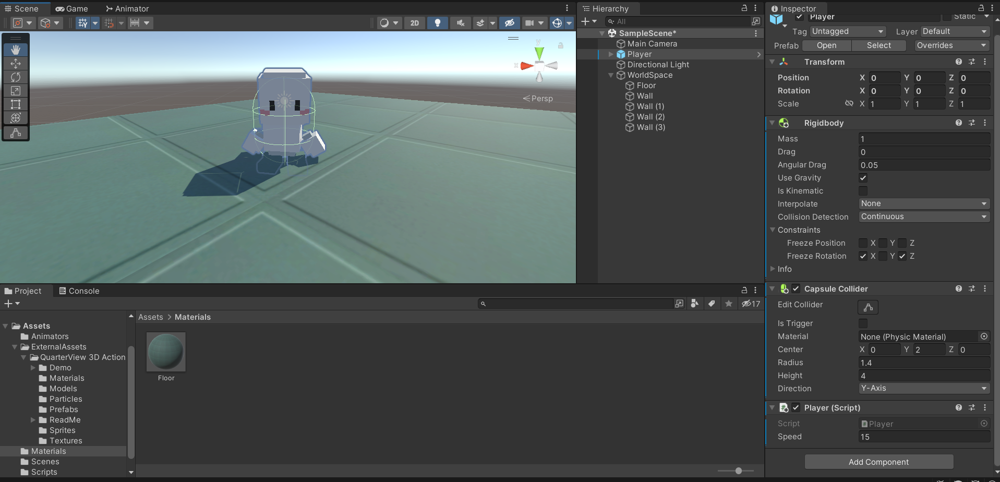


### 6. 캐릭터 기본 이동 구현

```c#
public class Player : MonoBehaviour
{

    public float speed; // 인스펙터 창에서 설정할 수 있도록 public 변수 추가

    // Input Axis 값을 받을 전역변수 선언
    float hAxis;
    float vAxis;

    Vector3 moveVec;

    void Start()
    {
        
    }

    void Update()
    {
        hAxis = Input.GetAxisRaw("Horizontal"); 
        vAxis = Input.GetAxisRaw("Vertical");

        moveVec = new Vector3(hAxis, 0, vAxis).normalized; 
        // Vector3(x, y, z)
        // normalized : 방향 값이 1로 보정된 벡터
        
		transform.position += moveVec * speed * Time.deltaTime;
    }
}

```

* Horizontal과 Vertical은 뭘까?

  * [Edit] - [Project Settings] - [Input Manager] - [Axes] 
  * Input Manager에서 관리, Name을 원하는 대로 바꾸어서 사용 가능
  * https://docs.unity3d.com/kr/2021.3/Manual/class-InputManager.html

  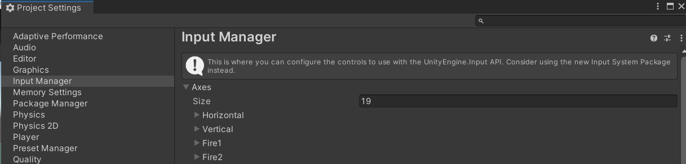

* Vector3 
  * 3D 벡터의 값을 표현하기 위한 데이터 타입
  * transform 이동은 무조건 Vector3를 사용
  * x축은 Horizontal, z축은 Vertical을 사용
* normalized
  * 오브젝트 균일한 이동을 위한 벡터의 정규화
  * 방향 값이 1로 보정된 벡터로 어떤 방향이든 같은 값(속도)을 가질 수 있도록 함
* public으로 변수 선언 시 Inspector에서 값을 변경할 수 있음

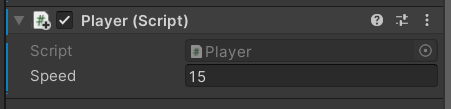

### # 관성에 의해 캐릭터가 넘어지지 않도록 설정

* [Inspector] - [Rigidbody] - [Constraints] - [Freeze Rotation] - [X], [Z] 체크


### # 캐릭터의 transform 이동이 물리 충돌을 무시하는 경우 해결 방법

* [Inspector] - [Rigidbody] - [Collision Detection] - "Continuous" 변경

* 벽에 Collider를 넣어도 물체를 통과하는 경우
  * 물체의 가속도가 일정량 이상으로 올라가면 생기는 버그
  * [Inspector] - [Rigidbody] - [Interpolate] - "Extrapolate" 변경
  * [Inspector] - [Rigidbody] - [Collision Detection] - "Continuous Dynamic" 변경 : 성능이 많이 떨어지기 때문에 추천하지 않음!
  * 


### 7. 캐릭터 애니메이션 생성

* [Create] - [Animator Controller] 생성

* 생성한 Controller를 캐릭터의 자식 오브젝트(Mesh Object)에 끌어놓기

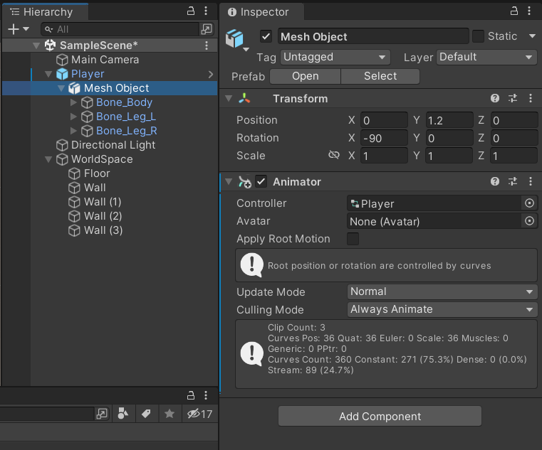


### 8. Animator Controller 

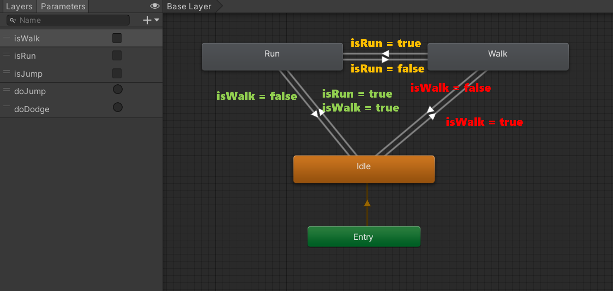

* Shift를 누르면 걷기 -> 달리기
* 각 애니메이션 상태를 [우클릭] - [Make Transition]을 통해 연결
* Parameters : 애니메이션 상태를 바꾸기 위한 조건
* Idle -> Walk : isWalk = true
* Walk -> Idle : isWalk = false
* Walk -> Run : isRun = true
* Run -> Walk : isRun = false
* Run -> Idle : isWalk = false // Shift를 떼도 달리기에서 걷기, 걷기에서 멈추기를 위함
* Idle -> Run : isWalk = true, isRun = true (걷기와 달리기 둘 다 만족해야 함)

* Transition 선택 후 Inspector 설정
  * [Has exit Time] 체크 해제
  * [Settings] - [Transition Duratior] 애니메이션 시간 설정
  * [Conditions] 조건 추가

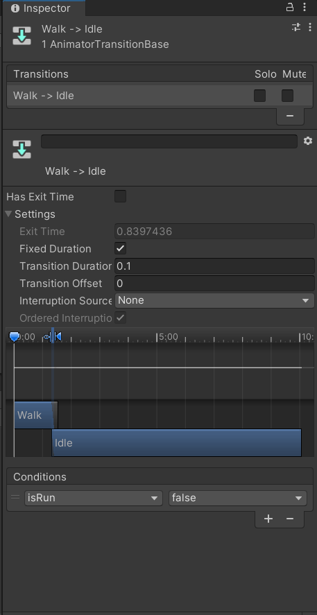


* Size 조절을 통해 Axes 속성을 추가 가능

  * Name : Run
  * Positive button : left shift
  * 왼쪽 shift를 누르면 Run

  

```c#
// Player.cs
using System.Collections;
using System.Collections.Generic;
using UnityEngine;

public class Player : MonoBehaviour
{

    public float speed;

    float hAxis;
    float vAxis;
    bool runDown; // runDown : Shift를 누르면 달리기

    Vector3 moveVec;

    Animator anim;

    void Start()
    {
        // Animator 컴포넌트 가져오기
        // Animator 컴포넌트를 Player 안에 Child로 넣어놓았기 때문에 가져올 때 또한 GetComponent가 아닌 GetComponentInChild를 이용해야 함
        anim = GetComponentInChildren<Animator>();
    }   

    void Update()
    {
        hAxis = Input.GetAxis("Horizontal");
        vAxis = Input.GetAxis("Vertical");
        runDown = Input.GetButton("Run"); // Left Shift 버튼을 꾹 누르고(=>GetButton) 있어야만 달리기 가능 


        moveVec = new Vector3(hAxis, 0, vAxis).normalized; // x, y, z
                                                           // normalized : 어떤 방향이든 같은 값(속도)을 가질 수 있도록 함, 방향 값이 1로 보정된 벡터

        if(runDown) // 달리기
            transform.position += moveVec * speed* Time.deltaTime; // transform 이동은 꼭 Time.deltaTime까지 곱해줌!
        else // 걷기
            transform.position += moveVec * speed * 0.3f * Time.deltaTime; // 걷기는 속도가 더 느리기 때문에 *0.3f

        // SetBool 함수로 파라미터 값 설정
        anim.SetBool("isWalk", moveVec != Vector3.zero);
        anim.SetBool("isRun", runDown);

        // 앞으로 나아가는 방향을 바라본다.
        transform.LookAt(transform.position + moveVec);
    }
}

```

* Input.GetAxis() : -1, 0, 1, 세 가지 값 중 하나가 반환, 키보드 값을 눌렀을 때 즉시 반응해야 할 경우에 사용
* Input.GetAxisRaw() : -1.0f ~ 1.0f 까지의 범위의 값을 반환, 부드러운 이동이 필요한 경우에 사용
* Time.deltaTime() : Time.deltaTime을 사용하면 프레임이 달라져도 동일한 성능을 낼 수 있음


### 9. 기본 회전 구현

```c#
// 앞으로 나아가는 방향을 바라본다.
transform.LookAt(transform.position + moveVec);
```


### 10. 카메라 이동

```c#
// Follow.cs
using System.Collections;
using System.Collections.Generic;
using UnityEngine;

public class Follow : MonoBehaviour
{
    // 카메라가 따라다녀야 할 타겟
    public Transform target;
    // 보정값:  따라갈 목표와 위치 오프셋을 public 변수로 선언
    public Vector3 offset;

    void Update()
    {
        transform.position = target.position + offset;        
    }
}

```

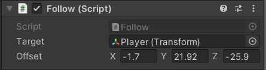

* Main Camera에 "Follow.cs" Script Component 추가
* Target : 따라다녀야 할 캐릭터 설정
* Offset : 캐릭터의 위치와 동일한 좌표를 넣고, 원하는 카메라 위치로 좌표 설정


------

### 11. 캐릭터 걷기, 달리기까지 최종 코드(함수 정리)

```c#
using System.Collections;
using System.Collections.Generic;
using UnityEngine;

public class Player : MonoBehaviour
{

    public float speed;

    float hAxis;
    float vAxis;
    bool runDown; // runDown : Shift를 누르면 달리기

    Vector3 moveVec;

    Animator anim;

    void Start()
    {
        // Animator 컴포넌트 가져오기
        // Animator 컴포넌트를 Player 안에 Child로 넣어놓았기 때문에 가져올 때 또한 GetComponent가 아닌 GetComponentInChild를 이용해야 함
        anim = GetComponentInChildren<Animator>();
    }   

    void Update()
    {
        GetInput(); // 제일 위에 작성

        Move();
        Turn();
    }

    void GetInput()
    {
        hAxis = Input.GetAxis("Horizontal");
        vAxis = Input.GetAxis("Vertical");
        runDown = Input.GetButton("Run"); // Left Shift 버튼을 꾹 누르고(=>GetButton) 있어야만 달리기 가능 
    }

    void Move()
    {
        moveVec = new Vector3(hAxis, 0, vAxis).normalized; // x, y, z
                                                           // normalized : 어떤 방향이든 같은 값(속도)을 가질 수 있도록 함, 방향 값이 1로 보정된 벡터

        if (runDown) // 달리기
            transform.position += moveVec * speed * 3.0f * Time.deltaTime; // transform 이동은 꼭 Time.deltaTime까지 곱해줌!
        else // 걷기
            transform.position += moveVec * speed * 1f * Time.deltaTime; // 걷기는 속도가 더 느리기 때문에 *0.3f

        // SetBool 함수로 파라미터 값 설정
        anim.SetBool("isWalk", moveVec != Vector3.zero);
        anim.SetBool("isRun", runDown);
    }

    void Turn()
    {
        // 나아가는 방향을 바라본다.
        transform.LookAt(transform.position + moveVec);
    }
}

```


### 12. 캐릭터 점프 코드 구현

* Floor 오브젝트에 태그 추가
* [Inspector] - [Tag] - [Add Tag] - [+] - "사용할 태그명 지정"

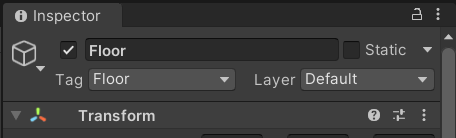

```c#
using System.Collections;
using System.Collections.Generic;
using UnityEngine;

public class Player : MonoBehaviour
{

    public float speed;
    public float jumpPower;

    float hAxis;
    float vAxis;
    bool runDown; 
    bool jumpDown; // jumpDown : Space를 누르면 점프

    bool isJump; // 점프 수행 여부

    Vector3 moveVec;

    Rigidbody rigid; // 물리 효과를 위해 Rigidbody 변수 선언
    Animator anim;

    void Start()
    {
        anim = GetComponentInChildren<Animator>();
        rigid = GetComponent<Rigidbody>(); // Child이 아니기 때문에 GetComponent 사용 
    }   

    void Update()
    {
        GetInput(); 

        Move();
        Turn();  
        Jump();
    }

    void GetInput()
    {
        hAxis = Input.GetAxis("Horizontal");
        vAxis = Input.GetAxis("Vertical");
        runDown = Input.GetButton("Run"); 
        jumpDown = Input.GetButtonDown("Jump"); // Space를 누르는 즉시 점프
    }

    void Move()
    {
        moveVec = new Vector3(hAxis, 0, vAxis).normalized; 
        if (runDown) // 달리기
            transform.position += moveVec * speed * 3.0f * Time.deltaTime; 
        else 
            transform.position += moveVec * speed * 1f * Time.deltaTime; 


        anim.SetBool("isWalk", moveVec != Vector3.zero);
        anim.SetBool("isRun", runDown);
    }

    void Turn()
    {
        transform.LookAt(transform.position + moveVec);
    }

    void Jump()
    {
        if(jumpDown && !isJump) // Space를 눌렀고, 점프 중인 상태가 아닐 때 => 점프 가능
        {
            rigid.AddForce(Vector3.up * jumpPower, ForceMode.Impulse); // AddForce 함수로 물리적인 힘을 가할 수 있음
            isJump = true;
        }

    }

    // 충돌 정보를 얻을 수 있는 함수
    private void OnCollisionEnter(Collision collision)
    {
        // 충돌한 게임 오브젝트의 태그가 "Floor" 일 경우
        if(collision.gameObject.tag == "Floor")
        {
            isJump = false; // 바닥과 충돌
        }
    }
}

```


### 13. 캐릭터 점프 애니메이션

* AnyState로 어떤 상태에서든 실행, Exit으로 원상복귀
* AnyState에서 나가는 애니메이션은 모두 일회성 애니메이션으로 Trigger 파라미터 사용
  * [+] - [Trigger] - "doJump", "doDodge" 생성
  * [+] - [bool] - "isJump" 생성

* Dodge는 회피 동작으로 본 프로젝트에서는 사용하지 않을 듯


### 14. 프로젝트 중력 설정

* [Edit] - [Project Settings] - [Physics] - [Gravity] - Default = -9.81 -> -25로 변경
* 중력이 커질수록 JumpPower가 약해짐 -> JumpPower 값 수치 변경


### 15. 지형 물리 강화

* 모든 맵 오브젝트를 정적으로 변경

* [Inspector] - [Static] 체크 - [Yes]

* Static으로 바꾸는 이유는?

  * 캐릭터의 transform 이동이 물리 충돌을 무시하는 것을 해결하는 방법으로 캐릭터의 [Inspector] - [Collision Dection] - "Continuous"로 설정
  * [Collision Dection] - "Continuous"는 Static과 충돌할 때 효과적

  

* 두 물체가 충돌할 때, 유니티가 효과적으로 충돌 계산을 하기 위해서는 두 물체가 Rigidbody를 갖는 것이 좋음

  * 캐릭터는 Rigidbody 컴포넌트를 갖지만, 지형 오브젝트는 Rigidbody가 없기 때문에 추가해줌
  * 지형 오브젝트에 Rigidbody를 추가할 경우
    * [Use Gravity] 체크 해제
    * [Is Kinematic] 체크 : 코드상으로 오브젝트를 움직이지 않는 이상 오브젝트는 고정

  

 * [Rigidbody] 우클릭 - [Copy Component] - 모든 지형 선택 후 [Paste Component Values]


* 마찰력이 없는 벽 생성
  * 캐릭터가 점프 시 벽에 붙는 것을 방지하기 위함
  * "Materials" 폴더 - 우클릭 [Create] - [Physics Material] 추가
    * 모든 값을 0으로 변경
    * 마찰력을 최소로 하기 위해 [Friction Combine] - "Minimum" 


* 생성한 Wall (Physics Material)을 벽 오브젝트의 [Inspector] - [Box Collider] - [Material]에서 변경
*  

### # 3인칭 시점 이동 코드

```c#
using System.Collections;
using System.Collections.Generic;
using UnityEngine;

public class Player : MonoBehaviour
{

    public float speed;
    public float jumpPower;

    float hAxis;
    float vAxis;
    bool runDown; // runDown : Shift를 누르면 달리기
    bool jumpDown; // jumpDown : Space를 누르면 점프

    bool isJump; // 점프 수행 여부

    Vector3 moveVec;

    Rigidbody rigid; // 물리 효과를 위해 Rigidbody 변수 선언
    Animator anim;

    void Start()
    {
        // Animator 컴포넌트 가져오기
        // Animator 컴포넌트를 Player 안에 Child로 넣어놓았기 때문에 가져올 때 또한 GetComponent가 아닌 GetComponentInChild를 이용해야 함
        anim = GetComponentInChildren<Animator>();
        rigid = GetComponent<Rigidbody>(); // Child이 아니기 때문에 GetComponent 사용 
    }   

    void Update()
    {
        GetInput(); // 제일 위에 작성

        Move();
        Turn();  
        Jump();
    }

    void GetInput()
    {
        hAxis = Input.GetAxisRaw("Horizontal");
        vAxis = Input.GetAxisRaw("Vertical");
        runDown = Input.GetButton("Run"); // Left Shift 버튼을 꾹 누르고(=>GetButton) 있어야만 달리기 가능 
        jumpDown = Input.GetButtonDown("Jump"); // Space를 누르는 즉시 점프
    }

    void Move()
    {
        moveVec = new Vector3(hAxis, 0, vAxis).normalized; // x, y, z
                                                           // normalized : 어떤 방향이든 같은 값(속도)을 가질 수 있도록 함, 방향 값이 1로 보정된 벡터

        if (runDown) // 달리기
            transform.position += moveVec * speed * 3.0f * Time.deltaTime; // transform 이동은 꼭 Time.deltaTime까지 곱해줌!
        else // 걷기
            transform.position += moveVec * speed * 1f * Time.deltaTime; // 걷기는 속도가 더 느리기 때문에 *0.3f

        // SetBool 함수로 파라미터 값 설정
        anim.SetBool("isWalk", moveVec != Vector3.zero);
        anim.SetBool("isRun", runDown);
    }

    void Turn()
    {
        // 나아가는 방향을 바라본다.
        transform.LookAt(transform.position + moveVec);
    }

    void Jump()
    {
        if(jumpDown && !isJump) // Space를 눌렀고, 점프 중인 상태가 아닐 때 => 점프 가능
        {
            rigid.AddForce(Vector3.up * jumpPower, ForceMode.Impulse); // AddForce 함수로 물리적인 힘을 가할 수 있음
            isJump = true;
        }

    }

    // 충돌 정보를 얻을 수 있는 함수
    private void OnCollisionEnter(Collision collision)
    {
        // 충돌한 게임 오브젝트의 태그가 "Floor" 일 경우
        if(collision.gameObject.tag == "Floor")
        {
            isJump = false; // 바닥과 충돌
        }
    }
}
// 코드 보관
```


* [Hierarchy] - [Main Camera] - Child 속성으로 들어가지 않음

* [Main Camera] - "Follow.cs" 파일 체크

  

### # 1인칭(뒷모습) 시점 이동 코드

```c#
using System.Collections;
using System.Collections.Generic;
using UnityEngine;

public class Player : MonoBehaviour
{

    public float speed;
    public float jumpPower;

    float hAxis;
    float vAxis;
    bool runDown; // runDown : Shift를 누르면 달리기
    bool jumpDown; // jumpDown : Space를 누르면 점프

    bool isJump; // 점프 수행 여부

    Vector3 moveVec;

    Rigidbody rigid; // 물리 효과를 위해 Rigidbody 변수 선언
    Animator anim;

    void Start()
    {
        // Animator 컴포넌트 가져오기
        // Animator 컴포넌트를 Player 안에 Child로 넣어놓았기 때문에 가져올 때 또한 GetComponent가 아닌 GetComponentInChild를 이용해야 함
        anim = GetComponentInChildren<Animator>();
        rigid = GetComponent<Rigidbody>(); // Child이 아니기 때문에 GetComponent 사용 
    }   

    void Update()
    {
        GetInput(); // 제일 위에 작성

        Move(); 
        Jump();
    }

    void GetInput()
    {
        hAxis = Input.GetAxisRaw("Horizontal");
        vAxis = Input.GetAxisRaw("Vertical");
        runDown = Input.GetButton("Run"); // Left Shift 버튼을 꾹 누르고(=>GetButton) 있어야만 달리기 가능 
        jumpDown = Input.GetButtonDown("Jump"); // Space를 누르는 즉시 점프
    }

    void Move()
    {
        moveVec = new Vector3(hAxis, 0, vAxis).normalized; // x, y, z
                                                           // normalized : 어떤 방향이든 같은 값(속도)을 가질 수 있도록 함, 방향 값이 1로 보정된 벡터

        if (runDown) // 달리기
            Walk(3.0f); // 달리기 속도는 걷기보다 빠르기 때문에 3.0f
        else // 걷기
            Walk(1.0f); // 걷기 1.0f 속도

        // SetBool 함수로 파라미터 값 설정
        anim.SetBool("isWalk", moveVec != Vector3.zero);
        anim.SetBool("isRun", runDown);
    }

    void Walk(float speedVal)
    {
        moveVec = new Vector3(hAxis, 0, vAxis).normalized;
        if (vAxis > 0)
        {
            this.transform.Translate(Vector3.forward * speed * speedVal * Time.deltaTime);
        }
        if(vAxis < 0)
        {
            this.transform.Translate(Vector3.back * speed * speedVal * Time.deltaTime);
        }
       if(hAxis < 0) 
        {
            if(vAxis >= 0)
            {
                // 회전 속도를 올리기 위해 speed에 *10을 더 해줌(일반적으로 회전 속도를 이동 속도보다 더 크게함)
                this.transform.Rotate(0, -speed  * Time.deltaTime * 10, 0); // 왼쪽 + 위 방향키 : 왼쪽으로 회전
            }
            else
            {
                this.transform.Rotate(0, speed * Time.deltaTime * 10, 0); // 왼쪽 + 아래 방향키 : 오른쪽으로 회전
            }
        }
        if (hAxis > 0)
        {
            if (vAxis >= 0)
            {
                this.transform.Rotate(0, speed * Time.deltaTime * 10, 0);  // 오른쪽 + 위 방향키 : 오른쪽으로 회전
            }
            else
            {
                this.transform.Rotate(0, -speed * Time.deltaTime * 10, 0); // 오른쪽 + 아래 방향키 : 왼쪽으로 회전 
            }
        }
    }


	// 점프는 제대로 작동 안 할 수 있음.. 수정 예정
    void Jump()
    {
        if(jumpDown && !isJump) // Space를 눌렀고, 점프 중인 상태가 아닐 때 => 점프 가능
        {
            rigid.AddForce(Vector3.up * jumpPower, ForceMode.Impulse); // AddForce 함수로 물리적인 힘을 가할 수 있음
            isJump = true;
        }

    }

    // 충돌 정보를 얻을 수 있는 함수
    private void OnCollisionEnter(Collision collision)
    {
        // 충돌한 게임 오브젝트의 태그가 "Floor" 일 경우
        if(collision.gameObject.tag == "Floor")
        {
            isJump = false; // 바닥과 충돌
        }
    }
}

```


* [Hierarchy] - 캐릭터 내부로 [Main Camera] 이동 
* "Follow.cs" 파일 체크 해제


### 16. 플레이어 자동 회전 방지

* 오브젝트와 부딪혔을 때 [Capsule Collider]에 의해서 캐릭터가 회전하는 문제를 방지

```c#
void FreezeRotation()
{
    // angularVelocity : 물리 회전 속도
    rigid.angularVelocity = Vector3.zero; // 회전 속도를 0로 유지
}
void FixedUpdate()
{
    FreezeRotation();
}
```

 

### 17. 플레이어 벽 관통 방지

* DrawRay() : Scene 내에서 Ray를 보여주는 함수
*  Raycast() : Ray를 쏘아 닿는 오브젝트를 감지하는 함수
  * "Wall" 이라는 LayerMask를 가진 오브젝트와 충돌하게 되면 isBorder = true로 변경

* 모든 벽 오브젝트의 Layer을 "Wall"로 변경시켜주어야 함
  * [Inspector] - [Layer] - [Add Layer] - "Wall" 추가 후 변경

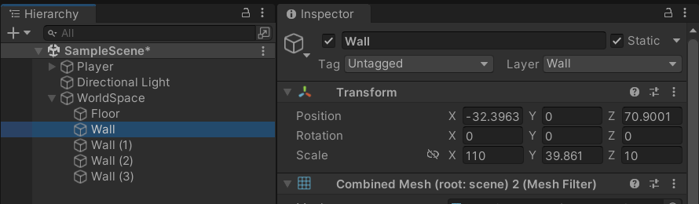

```c#

    bool isBorder; // 벽 충돌 플래그
    
    void Walk(float speedVal)
    {
        moveVec = new Vector3(hAxis, 0, vAxis).normalized;
        if (vAxis > 0)
        {
            // 1인칭이기 때문에 캐릭터가 이동하려면 무조건 위 방향키를 눌러야 함
            // 따라서 isBorder 플래그 또한 앞으로 이동하는 경우에만 조건 사용하면 됨
            // 다른 이동 방향(예를 들어, 뒤로 이동)에 if(!isBorder) 조건을 넣으면 움직임이 이상해짐 
            if (!isBorder) // Ray가 벽에 부딪히지 않았다면
            {
                this.transform.Translate(Vector3.forward * speed * speedVal * Time.deltaTime);
            }
        }
        ....
    }

    void StopToWall()
    {
        Debug.DrawRay(transform.position, transform.forward * 5, Color.green); // Scene 내에서 Ray를 보여주는 함수
        isBorder = Physics.Raycast(transform.position, transform.forward, 5, LayerMask.GetMask("Wall")); 

    }

    void FixedUpdate()
    {
        FreezeRotation();
        StopToWall();
    }

```

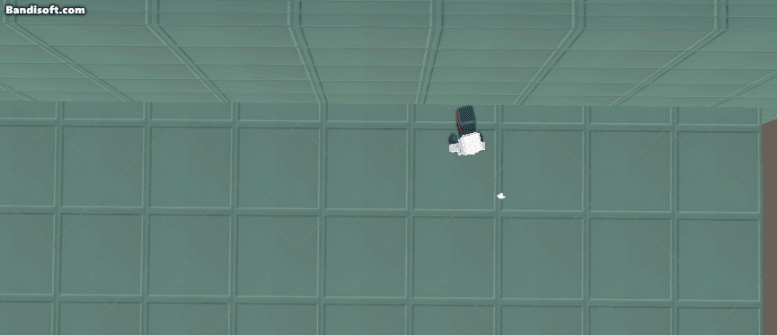


------

### 18. 1~17까지 전체 코드

```c#
using System.Collections;
using System.Collections.Generic;
using UnityEngine;

public class Player : MonoBehaviour
{

    public float speed;
    public float jumpPower;

    float hAxis;
    float vAxis;
    bool runDown; // runDown : Shift를 누르면 달리기
    bool jumpDown; // jumpDown : Space를 누르면 점프
    bool dodgeDown;

    bool isJump; // 점프 수행 여부
    bool isDodge; // 회피 수행 여부

    bool isBorder; // 벽 충돌 플래그

    Vector3 moveVec;

    Rigidbody rigid; // 물리 효과를 위해 Rigidbody 변수 선언
    Animator anim;

    void Start()
    {
        // Animator 컴포넌트 가져오기
        // Animator 컴포넌트를 Player 안에 Child로 넣어놓았기 때문에 가져올 때 또한 GetComponent가 아닌 GetComponentInChild를 이용해야 함
        anim = GetComponentInChildren<Animator>();
        rigid = GetComponent<Rigidbody>(); // Child이 아니기 때문에 GetComponent 사용 
    }   

    void Update()
    {
        GetInput(); // 제일 위에 작성


        Move();
        Jump();
        Dodge();
    }

    void GetInput()
    {
        hAxis = Input.GetAxisRaw("Horizontal");
        vAxis = Input.GetAxisRaw("Vertical");
        runDown = Input.GetButton("Run"); // Left Shift 버튼을 꾹 누르고(=>GetButton) 있어야만 달리기 가능 
        jumpDown = Input.GetButtonDown("Jump"); // Space를 누르는 즉시 점프
        dodgeDown = Input.GetButtonDown("Dodge"); // Q를 누르면 회피 동작
    }

    void Move()
    {
        moveVec = new Vector3(hAxis, 0, vAxis).normalized; // x, y, z
                                                           // normalized : 어떤 방향이든 같은 값(속도)을 가질 수 있도록 함, 방향 값이 1로 보정된 벡터
 

        if (runDown) // 달리기
            Walk(1.5f); // 달리기 속도는 걷기보다 빠르기 때문에 3.0f
        else // 걷기
            Walk(0.8f); // 걷기 1.0f 속도
        

        // SetBool 함수로 파라미터 값 설정
        anim.SetBool("isWalk", moveVec != Vector3.zero);
        anim.SetBool("isRun", runDown);
    }

    void Walk(float speedVal)
    {
        moveVec = new Vector3(hAxis, 0, vAxis).normalized;
        if (vAxis > 0)
        {
            if (!isBorder)
            {
                this.transform.Translate(Vector3.forward * speed * speedVal * Time.deltaTime);
            }
        }
        if (vAxis < 0)
        {
           
             this.transform.Translate(Vector3.back * speed * speedVal * Time.deltaTime);

            
        }
       if(hAxis < 0) 
        {
            if (vAxis >= 0)
            {
                
                // 회전 속도를 올리기 위해 speed에 *10을 더 해줌(일반적으로 회전 속도를 이동 속도보다 더 크게함)
                this.transform.Rotate(0, -speed * Time.deltaTime * 10, 0); // 왼쪽 + 위 방향키 : 왼쪽으로 회전
                
            }
            else
            {
                 this.transform.Rotate(0, speed * Time.deltaTime * 10, 0); // 왼쪽 + 아래 방향키 : 오른쪽으로 회전
            }
        }
        if (hAxis > 0)
        {
            if (vAxis >= 0)
            {

                this.transform.Rotate(0, speed * Time.deltaTime * 10, 0);  // 오른쪽 + 위 방향키 : 오른쪽으로 회전
            }
            else
            {
                this.transform.Rotate(0, -speed * Time.deltaTime * 10, 0); // 오른쪽 + 아래 방향키 : 왼쪽으로 회전 
            }
        }
    }


    void Jump()
    {
        if(jumpDown  && !isJump && !isDodge) // Space를 눌렀고, 점프 중인 상태가 아닐 때 => 점프 가능 
                                                                       // 회피하는 도중에는 점프 불가능
        {
            rigid.AddForce(Vector3.up * jumpPower, ForceMode.Impulse); // AddForce 함수로 물리적인 힘을 가할 수 있음
            anim.SetBool("isJump", true);
            anim.SetTrigger("doJump");
            isJump = true;
        }

    }

    void Dodge()
    {
        if (dodgeDown && !isJump && !isDodge) 
        {
            speed *= 2; // 회피의 속도는 2배 빠름
            anim.SetTrigger("doDodge");
            isDodge = true;

            Invoke("DodgeOut", 0.4f); // 시간차 함수 호출 (함수명, 시간차)

        }

    }

    void DodgeOut()
    {
        speed /= 2; // 원래 속도로 되돌림
        isDodge = false;
    }

    // 충돌 정보를 얻을 수 있는 함수
    private void OnCollisionEnter(Collision collision)
    {
        // 충돌한 게임 오브젝트의 태그가 "Floor" 일 경우
        if(collision.gameObject.tag == "Floor")
        {
            isJump = false; // 바닥과 충돌
            anim.SetBool("isJump", false);
        }
    }

    // 플레이어 회전 방지
    void FreezeRotation()
    {
        // angularVelocity : 물리 회전 속도
        rigid.angularVelocity = Vector3.zero; // 회전 속도를 0로 유지
    }

    void StopToWall()
    {

        Debug.DrawRay(transform.position, transform.forward * 5, Color.red); // Scene 내에서 Ray를 보여주는 함수
        isBorder = Physics.Raycast(transform.position, transform.forward, 5, LayerMask.GetMask("Wall")); 
        // Raycast() : Ray를 쏘아 닿는 오브젝트를 감지하는 함수
        // "Wall" 이라는 LayerMask를 가진 오브젝트와 충돌하게 되면 isBorder = true로 변경

    }

    void FixedUpdate()
    {
        FreezeRotation();
        StopToWall();
    }

}

```


