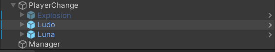
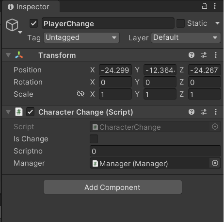
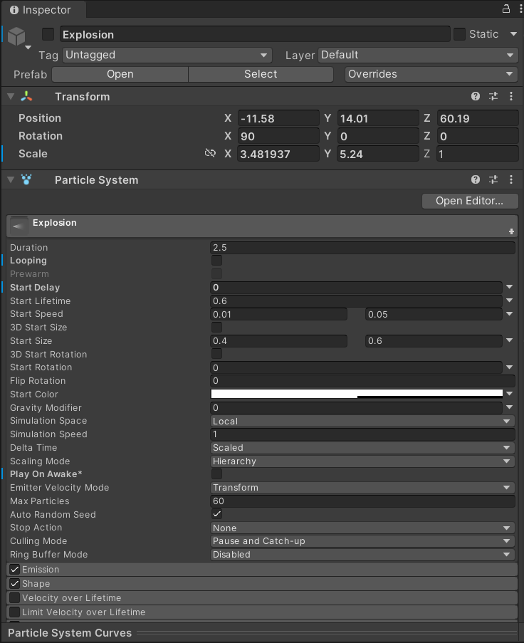
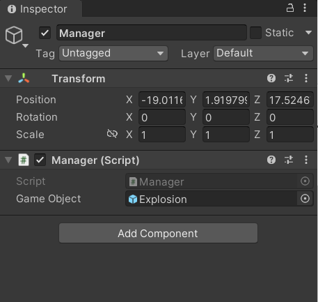
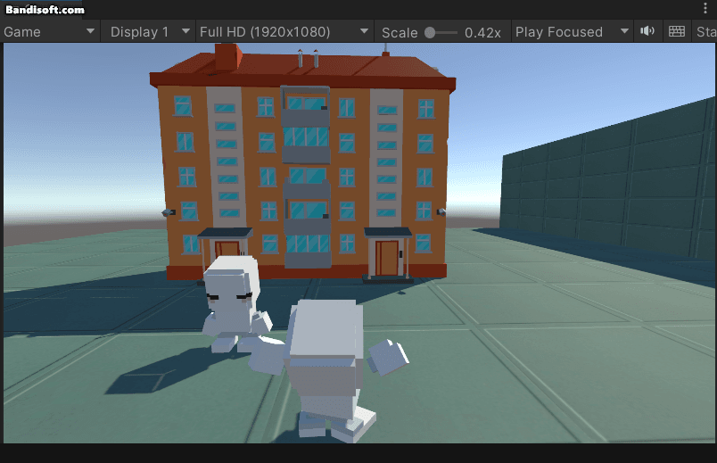

## [Ep0. 과거 회상] 캐릭터 사람 -> 동물 변경


### Hierarchy

* Ludo : 변경 전 사람 캐릭터
* Luna : 변경 후 동물 캐릭터
* Explosion : 폭발 효과
* Manager : Explosion 관리를 위한 Empty Object




### PlayerChange

* CharacterChange.cs 스크리븥 연결
* Manager 변수에 Manager.cs 연결




### Explosion

* Object Active 체크 해제 필수
* Duration = 2.5
  *  실행 시 지속 시간(cs 파일에서 사용됨)
* Play On Awake  체크 해제
  * 활성화하면 오브젝트가 생성될 때 파티클 시스템이 자동으로 시작




### Manager

* Explosion의 Activate를 관리하기 위한 Empty Object
* Manager.cs 스크립트와 연결
* Explosion 객체와 연결




```c#
// Manager.cs
using System.Collections;
using System.Collections.Generic;
using UnityEngine;

public class Manager : MonoBehaviour
{
    public GameObject gameObject;

    public void Appear()
    {
        // Explosion Active true
        gameObject.SetActive(true);
    }

    void Start()
    {
        
    }

    void Update()
    {
        
    }
}

```

```c#
// CharacterChange.cs
using System.Collections;
using System.Collections.Generic;
using UnityEngine;

public class CharacterChange : MonoBehaviour
{

    public int scriptno; // 진행중인 스크립트 번호
    GameObject before; // 변경 전 캐릭터
    GameObject after; // 변경 후 캐릭터

    public Manager manager; // Explosion 관리 클래스?

    void Start()
    {
        scriptno = 0;

        before = GameObject.Find("Ludo");
        after = GameObject.Find("Luna");

        after.SetActive(false); // 변경 후 캐릭터 미리 숨겨놓기
    }

    void Update()
    {
        if (Input.GetKeyDown(KeyCode.P)) // P키를 누르면 다음 스크립트로 넘기기
        {
            scriptno++;
            Debug.Log("scriptno : " + scriptno);
            if (scriptno == 5) // scriptno = 5(임시번호) - 캐릭터 변신
                Change();
        }
    }

    void Change()
    {
        before.SetActive(false); // 기존 사람 캐릭터 사라짐
        after.SetActive(true); // 동물 캐릭터 나타남

        manager.Appear(); // 펑 효과 나타남
        GameObject.Find("Explosion").GetComponent<ParticleSystem>().Play(); // 효과 플레이

    }

}

```




### 기타

* 흥청망청 효과는 비슷하게 구현하면 될 듯함

* 폭발 효과 페이드인/페이드아웃? - 에셋 분위기보고 추후 구현

  