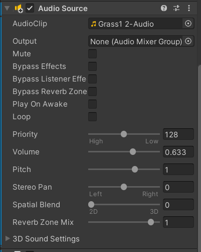

## 캐릭터 걷기 및 달리기 소리

### Player Component Setting

* [Add Component] - "Audio Source"
* "AudioClip" 오디오 설정
* "Play On Awake" 체크 해제

 


* 달리기는 걷기보다 발자국 소리 속도가 더 빠름
* 점프하는 동안에는 발자국 소리가 나지 않음

```c#
public class Player : MonoBehaviour
{

	// ... 일부 코드 생략
    AudioSource audio;

    void Start()
    {
        anim = GetComponentInChildren<Animator>();
        rigid = GetComponent<Rigidbody>(); 
        audio = GetComponent<AudioSource>();
    }   

    void Update()
    {
        GetInput();


        Move();
        Jump();
        Dodge();
    }

    void Move()
    {
        moveVec = new Vector3(hAxis, 0, vAxis).normalized; 

        if (runDown)
        { 
            Walk(2.5f); 
            if (!GetComponent<AudioSource>().isPlaying)
            {
                GetComponent<AudioSource>().pitch = 3f; // 속도 조절, 달리기는 오디오 속도가 더 빠름
                GetComponent<AudioSource>().Play();
            }
        }
        else 
        {
            Walk(1f); 
            if (moveVec != Vector3.zero)
            {
                if (!GetComponent<AudioSource>().isPlaying)
                {
                    GetComponent<AudioSource>().pitch = 2f;
                    GetComponent<AudioSource>().Play();
                }
            }
        }
        anim.SetBool("isWalk", moveVec != Vector3.zero);
        anim.SetBool("isRun", runDown);
    }

   // ... 생략
    void Jump()
    {
        if(jumpDown  && !isJump && !isDodge) 
        {
            // 점프하는 동안에는 걷기&달리기 속도 뮤트
            GetComponent<AudioSource>().mute = true; 
            rigid.AddForce(Vector3.up * jumpPower, ForceMode.Impulse); 
            anim.SetBool("isJump", true);
            anim.SetTrigger("doJump");
            isJump = true;
        }

    }
   // ... 생략
}
```

