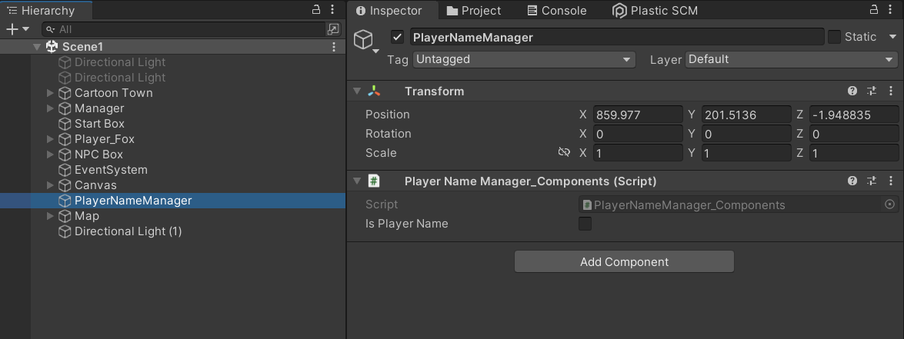

## 씬이 변경되어도 오브젝트를 유지하는 방법

* 유니티는 다른 씬으로 넘어가면 기본적으로 모든 오브젝트를 파괴함
* 이전 씬에서 사용하던 변수나 오브젝트를 DontDestroyOnLoad를 통해 다음 씬에서도 사용 가능


> 해당 프로젝트에서는 Scene1에서 플레이어의 닉네임을 받아 Scene1~Scene6까지 사용하기 때문에 씬이 변경되어도 플레이어의 닉네임을 유지해야 함
>
> PlayerNameManager 오브젝트를 이용하여 플레이어의 닉네임 유지

```c#
public class PlayerNameManager_Components : MonoBehaviour
{
    public static string playerName;

    void Awake()
    {
        DontDestroyOnLoad(this);
    }

    public string GetPlayerName()
    {
        return playerName;
    }

    public void SetPlayerName(string name)
    {
        playerName = name;
    }

}

```



1. Empty Object를 생성 -> PlayerNameManager
2. 1번에서 생성한 오브젝트에 PlayerNameManager_Components.cs 스크립트를 PlayerNameManager의 컴포넌트로 추가
3. DontDestoryOnLoad를 적용한 오브젝트는 항상 `계층의 최상단`에 위치해야 함
   * 다른 오브젝트의 하위 계층으로 위치할 경우 씬 변경 시 사라짐
