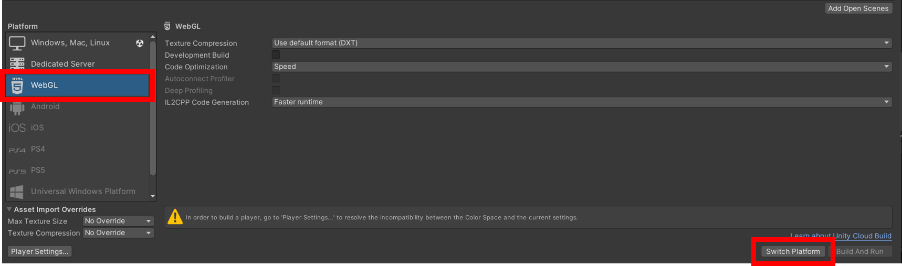
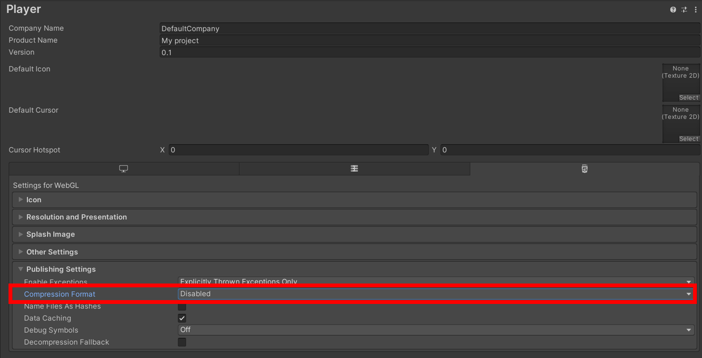
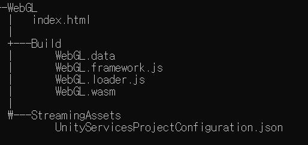
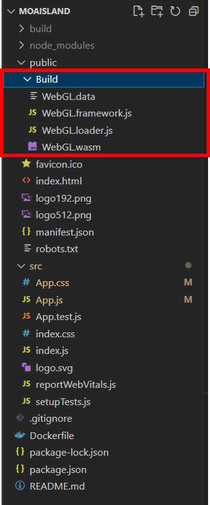
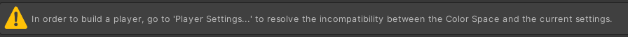
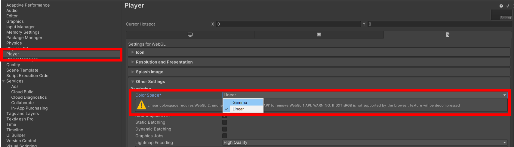
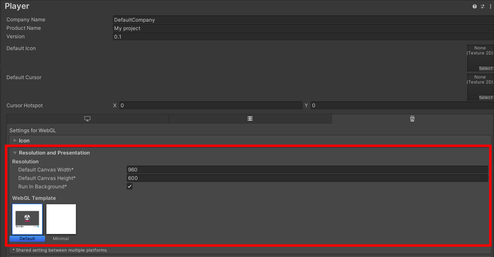
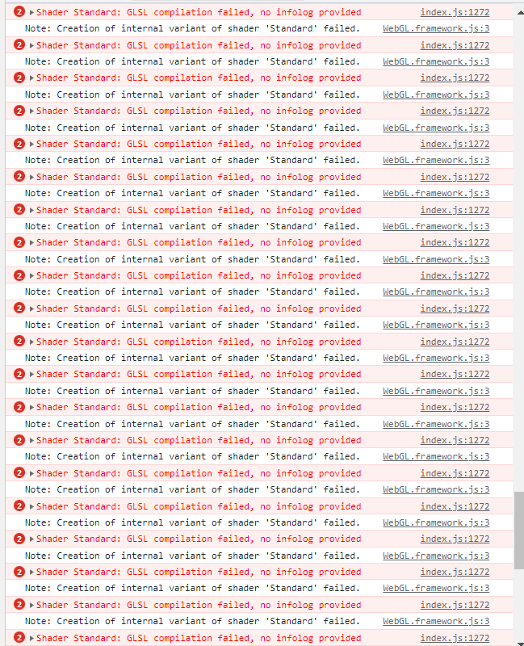

## Unity 프로젝트 빌드 후 React에 올리기

[TOC]

###  🔸Unity 프로젝트 빌드

1. [Edit] - [Build Settings...] - `[Platform] "WebGL"` - "Switch Platform"



2. [Player Settings...] - [Player] - [Publishing Settings] - `Compression Format "Gzip"에서 "Disable"`로 변경
   * Compression Format을 지정할 경우 리액트 렌더링 시에 에러가 발생




3. `Build` 또는 `Build And Run` 실행
   * /WebGL 폴더 생성 후 Build
4. /WebGL 폴더 안 index.html, `/Build`, /StreamingAssets 파일 및 폴더 생성
   * Build 안 파일들은 /WebGL 폴더 이름과 동일한 이름으로 생성됨
   * /WebGL이 아니라 /Unity 폴더에 빌드할 경우 Unity.data, Unity.framework.js... 생성



5. index.html 실행으로 결과를 확인할 경우 CORS 오류 발생


### 🔹React 프로젝트 생성

1. React 프로젝트 생성
2. npm install react-unity-webgl<@version>
   * Unity 버전에 맞는 react-unity-webgl 설치
   * 해당 프로젝트에서는 Unity 2021.3.11f1 버전이기에 8.x 버전 사용

```bash
$ npm install react-unity-webgl@8.x  # For Unity 2020 and 2021
$ npm install react-unity-webgl@7.x  # For Unity 2018 and 2019 (LTS)
$ npm install react-unity-webgl@6.x  # For Unity 2017 (LTS)
$ npm install react-unity-webgl@5.x  # For Unity 5.6 (LTS)
```

3. React 프로젝트 내 `/public` 내 유니티 빌드 후 생성된 `/Build` 폴더 추가



4. App.js 코드 작성

```js
import './App.css';
import React from "react";
import Unity, { UnityContext } from "react-unity-webgl";

const unityContext = new UnityContext({
  loaderUrl: "Build/WebGL.loader.js",
  dataUrl: "Build/WebGL.data",
  frameworkUrl: "Build/WebGL.framework.js",
  codeUrl: "Build/WebGL.wasm",
})

function App() {
  return (
    <div id="unity-container">
      { <Unity 
        style={{
          width: '80vw',
          height: '45vw',
        }}
        unityContext={unityContext} /> }
    </div>

  );
}

export default App;
```


------

### ❓기타 설정 및 오류 해결 과정

#### ✔Switch Platform 이후에 아래와 같은 경고가 나올 경우

> In order to build a player, go to 'Player Settings...' to resolve the incompatibility between Color Space and current settings



[Player Settings] - [Player] - [Other Settings] - `[Color Space] "Linear" 에서 "Gamma"로 변경` - [Change to Gamma]




#### ✔WebGL Template 변경 방법

* [Player Settings] - [Player] - [Resolution and Presentation]
* 캔버스 크기 변경 및 템플릿 변경 가능




#### ✔React에 Unity 프로젝트 배포 시 발생한 오류

> Shader Standard: GLSL compilation failed, no infolog provided
>
> ​	Note: Creation of internal variant of shader 'Standard' failed.
>
> Shader Legacy Shaders/Particles/Alpha Blended Premultiply: GLSL compilation failed, no infolog provided
>
> ​	Note: Creation of internal variant of shader 'Legacy Shaders/Particles/Alpha Blended Premultiply' failed.
>
> ...



* 위와 같은 오류가 발생할 경우 App.js에서 <Unity> width와 height를 지정해주면 오류가 발생하지 않음😭

```js
<Unity 
    style={{
           width: '80vw',
           height: '45vw',
          }}
    unityContext={unityContext} />
```


### 