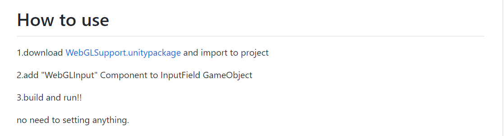
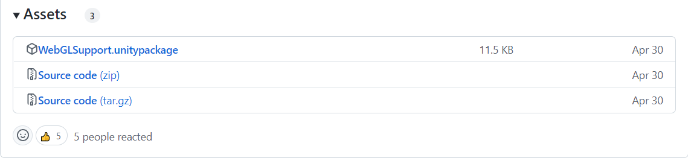
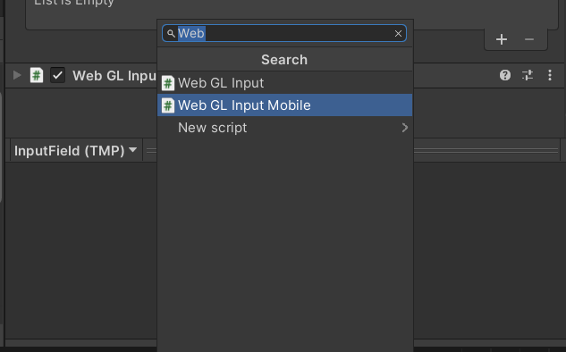

### WebGL 빌드 후 한글 입력이 안 될 경우

* 유니티 WebGL에서는 IME(Input Method Editor: 입력 방식 편집기)를 지원하지 않음
  * 한글 입력 전환이 안되고, 한영 전환을 눌러도 알파벳만 입력됨
  * 한글 폰트를 사용해도 안됨

1. https://github.com/kou-yeung/WebGLInput

2. WebGLSupport.unitypackage 다운로드

3. 다운로드 받은 패키지 -> 프로젝트에 import
   * import 방법 : 끌어다 놓으면 됨
4. 적용할 InputField에 Add Component로 WebGLInput 추가

5. Build and Run을 통해 실행된 화면에서는 오류가 나지만 React를 통해 빌드한 프로젝트를 올리면 한글 입력 가능